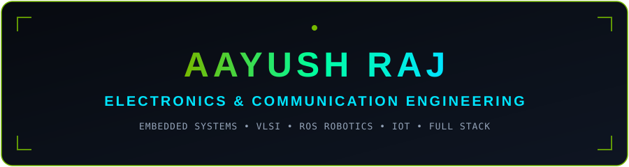
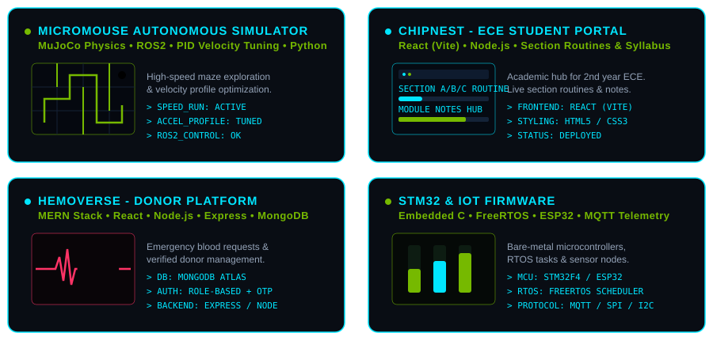

<div align="center">

<!-- Sleek Minimalist Cyber Tech Banner -->


<br><br>

<!-- Dynamic Cyber Typing Banner with Matrix Green Theme -->
<a href="https://git.io/typing-svg">
  
</a>

<br><br>

<!-- Profile Metrics & Badges -->
<p align="center">
  
  
  
  
</p>

</div>

---

<div align="center">
  <h2>⚡ DOMAINS & SKILL MATRIX ⚡</h2>
</div>

<!-- Animated Skill Grid SVG -->
<p align="center">
  
</p>

---

# 🚀 Featured Projects (Animated Showcase)

<div align="center">
  <p><i>Real-time visual telemetry animations showcasing active engineering projects.</i></p>
</div>

<!-- Animated Projects Showcase SVG -->
<p align="center">
  
</p>

---

# 👨‍💻 System Profile: About Me

```gcode
[STATUS]: OPERATIONAL
[LOCATION]: BIT Mesra
[MAJOR]: Electronics & Communication Engineering
[CORE FOCUS]: Hardware + Software + AI Integration
```

- 🎓 **ECE Undergraduate** at **Birla Institute of Technology, Mesra**
- 🤖 Passionate about **Autonomous Robotics**, **Embedded Microcontrollers**, **FPGA Design**, and **Intelligent Machines**
- 🚀 Specialized in building end-to-end systems connecting **Physical Chips** ➔ **Low-Level Firmware** ➔ **ROS2 Nodes** ➔ **MERN Web Applications**

---

# 🚀 Technology Stack & Domains

### 💻 Core Programming Languages
> *Optimized for hardware logic, performance, and web applications (Python, JS, HTML, C, CSS).*

<p align="left">
  
</p>

---

### 🛠️ Embedded Systems & Digital VLSI

<p align="left">
  
  
  
  
  
  
  
  
</p>

---

### 🌐 MERN Stack & Frontend Web Ecosystem
> *Full Stack Development with MERN Stack (React Vite, Node.js, Express, MongoDB) & Modern Frontend (React.js, HTML5, CSS3, JavaScript).*

<p align="left">
  
</p>

---

### 🤖 Robotics & Autonomous Systems

<p align="left">
  
  
  
  
  
</p>

---

### ⚙️ Developer Environment & Tools

<p align="left">
  
</p>

---

# 🌱 Active Technical Focus

```json
{
  "firmware": ["Embedded C", "STM32 Bare-Metal & HAL", "FreeRTOS Integration"],
  "silicon": ["Verilog HDL", "FPGA Synthesis", "ASIC Design Flow (EDA Tools)"],
  "autonomy": ["ROS2 Nav2 Stack", "Gazebo Physics Simulation", "OpenCV Perception"],
  "web": ["MERN Stack (MongoDB, Express, React, Node)", "React Vite", "JavaScript / HTML5 / CSS3"]
}
```

---

# 📂 Specialized Domain Summary

| Domain | Technologies & Frameworks | Status / Expertise |
| :--- | :--- | :--- |
| **Embedded Firmware** | Embedded C, STM32, ESP32, Arduino, FreeRTOS | `[ACTIVE CORE]` |
| **VLSI & Hardware** | Verilog HDL, Digital Logic, FPGA | `[ACTIVE CORE]` |
| **Robotics & AI** | ROS2, Gazebo, MAVLink, OpenCV, Python | `[EXPANDING]` |
| **Web Development** | MERN Stack (React Vite, Node.js, Express, MongoDB), React.js, HTML5, CSS3, JS | `[FULL STACK]` |
| **Languages** | Python, JavaScript, HTML, C, CSS | `[PRIMARY]` |

---

# 📊 GitHub Telemetry & Stats

<div align="center">

<!-- Custom Cyber Tech themed stats card -->


<!-- Top languages card -->


</div>

<br>

### 🔥 Contribution Streak
<div align="center">
  
</div>

<br>

### 📈 Activity Matrix
<div align="center">
  
</div>

<br>

### 🏆 Engineering Trophies
<div align="center">
  
</div>

---

# 🎯 Engineering Milestones

- [x] ⚡ Build bare-metal & RTOS projects on STM32 microcontrollers
- [x] ⚡ Synthesize digital logic designs using Verilog HDL on FPGAs
- [x] ⚡ Deploy full-stack MERN applications built with React (Vite), Node.js, Express, and MongoDB
- [/] 🤖 Develop autonomous swarm robot routines in ROS2 & Gazebo
- [/] 🔬 Master end-to-end ASIC design flow & timing analysis
- [ ] 📡 Deploy edge-AI inference models on high-performance embedded hardware

---

# 📫 Connect & Transmit

<p align="left">
  <a href="https://github.com/AayushRaj6447">
    
  </a>
</p>

---

<div align="center">

### 🟢 *"Turning Ideas into Intelligent Systems."*

Thank you for visiting my profile!

</div>
